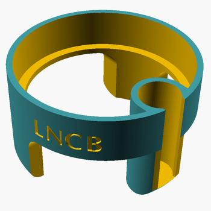
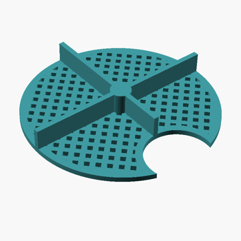

# Slice incubation chamber
These files are [OpenSCAD](http://openscad.org/) files, which create a slice incubation chamber that fits into a 250 ml glass beaker. The file is the source for both, the chamber and the grid/mesh, though there are two separate STL files for them. The small holder fits the [gas dispersion tubes](https://www.fishersci.com/shop/products/pyrex-gas-dispersion-tubes-with-fritted-cylinders-2/11138B) for continued oxygenation of the imersion solution.

The chamber went through multiple iterations since 2017 and the latest is version *3 E*, 
which shows small modifications to the previous version based on specific preferences. The chambers are in constant use in a laboratory setting. 

The version *3 D* has the following design: 

   

## Materials

The print material for the chamber is [PETG](https://www.acmeplastics.com/what-is-petg), which is considered food-safe. PETG worked well in the laboratory setting since 2017. *PLA* might also work, but I haven't tried it exhaustively.

The chamber needs to be submerged within a saline solution for long times, so the print material must be biological inert (i.e. not leaching any trace amounts) and create a solid surface to prevent any solution leaking into the inner structure (which, depending on the print, is often not solid but a 20-30% infill).

## Stuff

  
These files are copyrighted 2021 by R. Bock and are licensed under a [Creative Commons Attribution-NonCommercial-ShareAlike 4.0 International License](http://creativecommons.org/licenses/by-nc-sa/4.0/).
